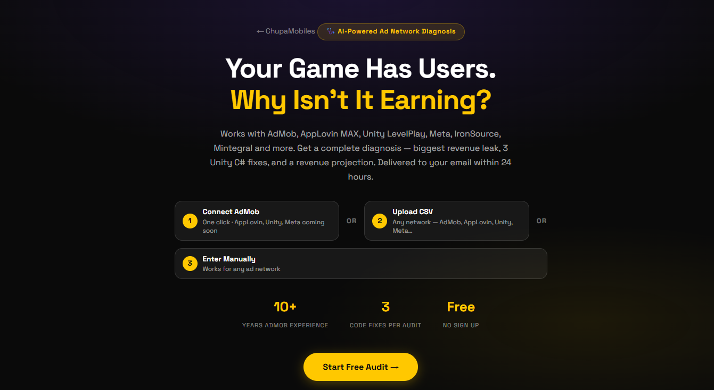
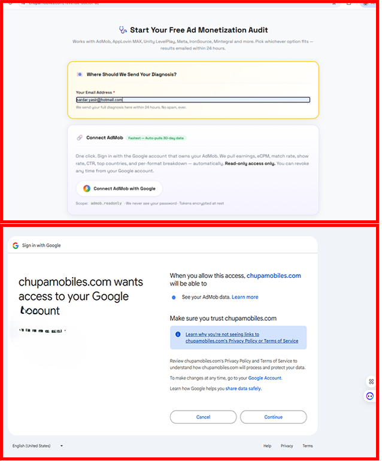
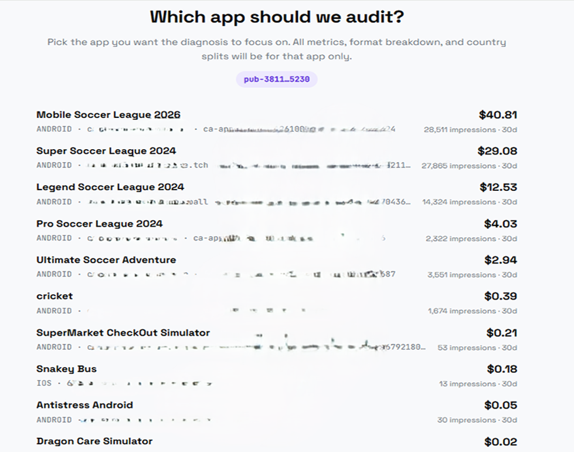
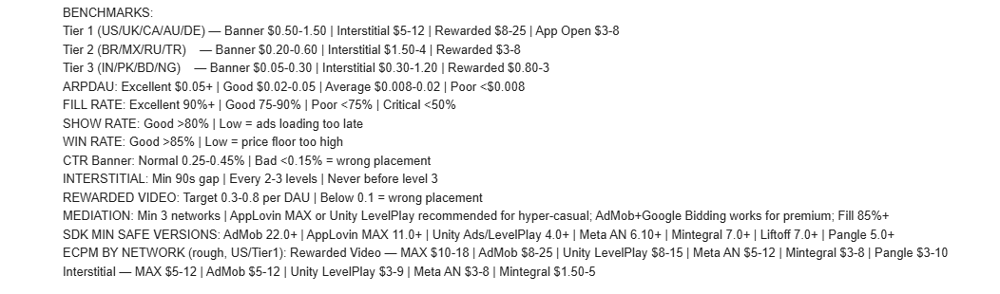
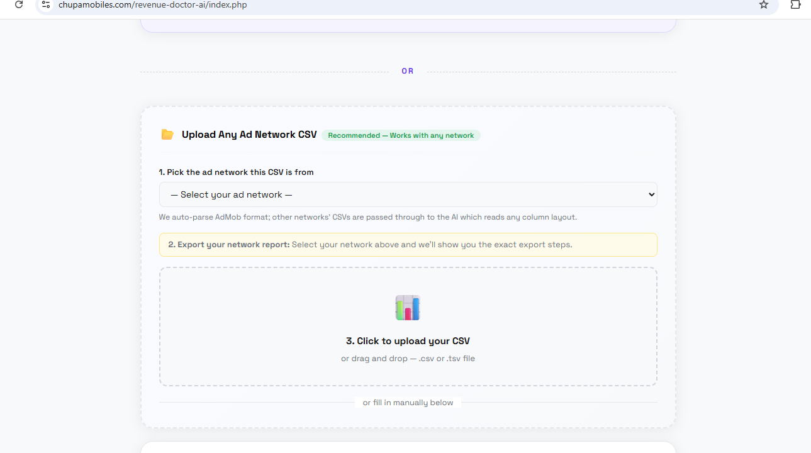
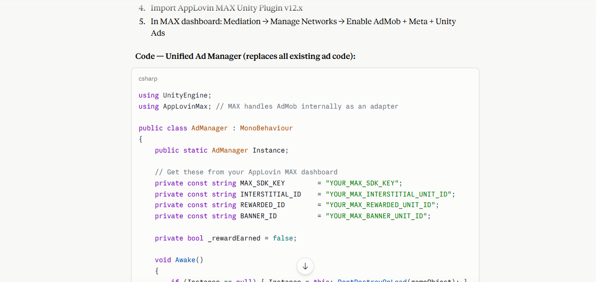

<div align="center">

# 🩺 Revenue Doctor AI

### AI-powered diagnosis for low-earning mobile games

[](https://chupamobiles.com/revenue-doctor-ai/)
[](https://chupamobiles.com)
[]()

**Your game has users. Why isn't it earning?**

A free AI auditor for mobile game monetization. Connect your ad network in one click, get a complete diagnosis emailed within 24 hours — the biggest revenue leak, 3 ranked fixes, **ready-to-paste Unity C# code**, and a realistic revenue projection.

[**▶ Get your free audit →**](https://chupamobiles.com/revenue-doctor-ai/)

</div>

---

  ---
## 🤔 Why does this exist?

Most indie mobile games earn **far less than they could**. Common reasons:

- Fill rate is 40% instead of 90%+ (you're losing 50% of impressions)
- Interstitials show too early or too often (Google quietly throttles you)
- No mediation, or wrong mediation order
- Outdated SDK with known fill-rate bugs
- Banner in the wrong place — invisible CTR
- Rewarded video buried where 90% of users never see it

These bugs are **fixable in hours**, but you need someone who's been through them. Revenue Doctor AI is that someone — backed by an AI trained on real benchmarks for AdMob, AppLovin MAX, Unity LevelPlay, Meta Audience Network, IronSource, Mintegral, Pangle, Liftoff, Chartboost, and more.

---

## ✨ What you get

Every audit includes:

| Section | What's inside |
| --- | --- |
| 🔴 **Biggest revenue leak** | The single highest-impact issue, in one sentence |
| 📊 **Metrics vs benchmarks** | Your numbers vs Tier 1 / 2 / 3 country averages, with monthly $ cost of each gap |
| 🎯 **Ad placement diagnosis** | Specific issues with your banner, interstitial, rewarded, and app-open setup |
| 🔧 **3 ranked code fixes** | Each with impact %, time estimate, and copy-paste Unity C# snippet |
| 💰 **Revenue projection** | Conservative + realistic estimates, days to see results |
| ⚡ **Mediation recommendation** | Network stack + order if fill rate is below 85% |
| 🚨 **SDK warnings** | Outdated SDK versions with known revenue-killing bugs |

---

## 🚀 How it works

```
  ┌──────────────────┐     ┌──────────────────┐     ┌──────────────────┐
  │ 1. Share data    │  →  │  2. AI analyzes  │  →  │ 3. Email arrives │
  │  3 ways to pick  │     │ vs benchmarks &  │     │  within 24 hrs   │
  │  from            │     │ known patterns   │     │  ready to apply  │
  └──────────────────┘     └──────────────────┘     └──────────────────┘
```

**Three ways to share your numbers — pick whichever is easiest:**

1. **🔗 Connect AdMob** — One-click sign-in with Google. Read-only access. We pull last 30 days of earnings, eCPM, match rate, show rate, CTR, top countries automatically. *AppLovin MAX, Unity Ads, Meta Audience Network integrations coming soon.*

2. **📂 Upload CSV** — Export from **any** ad network — AdMob, AppLovin, Unity LevelPlay, Meta, IronSource, Mintegral, Liftoff, Pangle, Chartboost, AdColony. Pick your network, drop the file in. Our AI parses any column layout.

3. **✍️ Enter Manually** — Just type DAU + monthly revenue. The audit works with whatever you have.

---

[](https://www.youtube.com/watch?v=H5ludhPT_uI)

---







---
## 🛡️ Security & privacy

- **Read-only access only.** We use the `admob.readonly` scope. We literally cannot see your password or change anything in your account.
- **Tokens encrypted at rest** with AES-256-GCM. The encryption key never leaves the server.
- **Revoke any time** from your Google account permissions page or with one click on our site.
- **No data resold.** We never sell, share, or syndicate your numbers. Your audit data is used only to generate your diagnosis.
- **No required signup.** Email is required only so we can send you the diagnosis.

Full privacy policy lives at [chupamobiles.com/privacy](https://chupamobiles.com).

---

## 📡 Supported ad networks

| Network | CSV Upload | Manual Entry | Auto-Connect |
| --- | :---: | :---: | :---: |
| Google AdMob | ✅ | ✅ | ✅ |
| AppLovin MAX | ✅ | ✅ | 🛣 coming soon |
| Unity LevelPlay (IronSource) | ✅ | ✅ | 🛣 coming soon |
| Unity Ads (legacy) | ✅ | ✅ | 🛣 |
| Meta Audience Network | ✅ | ✅ | 🛣 |
| IronSource (legacy) | ✅ | ✅ | 🛣 |
| Mintegral | ✅ | ✅ | 🛣 |
| Liftoff Monetize (Vungle) | ✅ | ✅ | 🛣 |
| Pangle (TikTok) | ✅ | ✅ | 🛣 |
| Chartboost | ✅ | ✅ | 🛣 |
| AdColony | ✅ | ✅ | 🛣 |
| DT FairBid (Fyber) | ✅ | ✅ | 🛣 |
| Tapjoy | ✅ | ✅ | 🛣 |
| InMobi | ✅ | ✅ | 🛣 |
| Other / Custom | ✅ | ✅ | — |

---

## 🗺️ Roadmap

- [x] AdMob OAuth + Reporting API integration
- [x] App picker (per-app diagnosis for multi-app accounts)
- [x] CSV upload for any ad network (AI parses any column layout)
- [x] Manual entry path
- [x] Mediation stack capture (multi-network checkboxes)
- [ ] AppLovin MAX OAuth integration
- [ ] Unity LevelPlay API integration
- [ ] Meta Audience Network API integration
- [ ] Pro tier — instant diagnosis (no 24h wait) + multiple monthly audits + history
- [ ] Live audit dashboard (re-run diagnoses anytime)
- [ ] Bidding waterfall A/B suggestions
- [ ] Slack / Discord bot for ongoing monitoring

---

## ❓ FAQ

<details>
<summary><b>Is this really free?</b></summary>

Yes. The audit itself is 100% free. We may launch a Pro tier later (instant results, monthly recurring audits, history dashboard) but the core diagnosis stays free.
</details>

<details>
<summary><b>Do you keep my AdMob data?</b></summary>

We cache the last 30 days of metrics we pulled to generate your audit. No write access, no payment data, no campaign details. You can revoke access and delete your data any time.
</details>

<details>
<summary><b>Why does Google show a "not verified" warning during sign-in?</b></summary>

The app is in OAuth verification while we hit the user threshold for Google's audit. The warning will go away once Google completes verification (typically 2-4 weeks). The flow is fully encrypted regardless — the warning is procedural, not a security flag.
</details>

<details>
<summary><b>What if I don't use Unity?</b></summary>

The audit still works — you just won't get Unity-specific C# code. We'll deliver the same diagnosis with native Android/iOS code snippets if you tell us your engine in the form. Cocos2d, Godot, custom engine — all welcome.
</details>

<details>
<summary><b>Who reads my audit data?</b></summary>

The data is processed by an AI model with a specialized monetization prompt. No human-in-the-loop reads your numbers in the default flow.
</details>

<details>
<summary><b>How accurate are the projections?</b></summary>

Projections are "conservative" and "realistic" ranges based on the gap between your current metrics and known benchmarks. They assume you actually apply the fixes. We don't promise specific outcomes — every game is different.
</details>

---

## 🏗️ Built by

Made by [**ChupaMobiles**](https://chupamobiles.com) — a marketplace for Unity game source code, reskinnable templates, and live published apps. Run by a Unity dev with 10+ years of mobile monetization battle scars.

Revenue Doctor AI exists because the founder spent years earning $1-5/day on games with thousands of users — and learned, the hard way, every reason why that happens. This is the tool he wishes had existed.

> "I had 2,000 daily users earning $1.50/day. After following the diagnosis I reached $14/day in 12 days. The Unity code was copy-paste ready — took 3 hours to implement all fixes."
> — *Indie game developer, Unity hyper-casual*

---

## 📬 Get in touch

- 🌐 Live tool: [chupamobiles.com/revenue-doctor-ai](https://chupamobiles.com/revenue-doctor-ai/)
- 🛒 Game source code marketplace: [chupamobiles.com](https://chupamobiles.com)
- 📧 Email: support@chupamobiles.com
- 🐦 Twitter / X: *coming soon — follow for build-in-public updates*

If your studio runs 5+ apps and wants bulk audits, white-label diagnosis reports, or API access — reach out.

---

## 📄 License

**All rights reserved.** This repository hosts marketing materials only — the underlying audit engine, system prompt, and AdMob OAuth integration are proprietary to ChupaMobiles. The product is free to use; the implementation is not open source.

If you're a fellow indie tooling builder and want to compare notes on benchmarks or mediation strategies, I'm friendly — just email. 🤝

---

<div align="center">

⭐ **Star this repo** if Revenue Doctor AI helps you find your revenue leak.

**[Try it free — no signup →](https://chupamobiles.com/revenue-doctor-ai/)**

</div>
